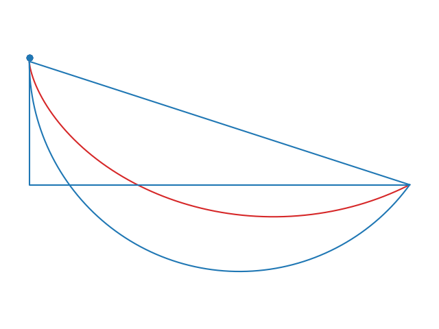

Overview
--------
This project simulates some interesting physics phenomena.

Contents
--------

The deflection of a falling object in the rotating frame.

由于地球自转的影响,无初速度下落的物体会有一个向东的偏移。

<table>
<tbody>
  <tr>
    <td></td>
    <td></td>
  </tr>
</tbody>
</table>

--------------------

The fastest descent line is not a straight line but a cycloid. It's a classic example of calculus of variations.

速降线问题的仿真。

-------------------------